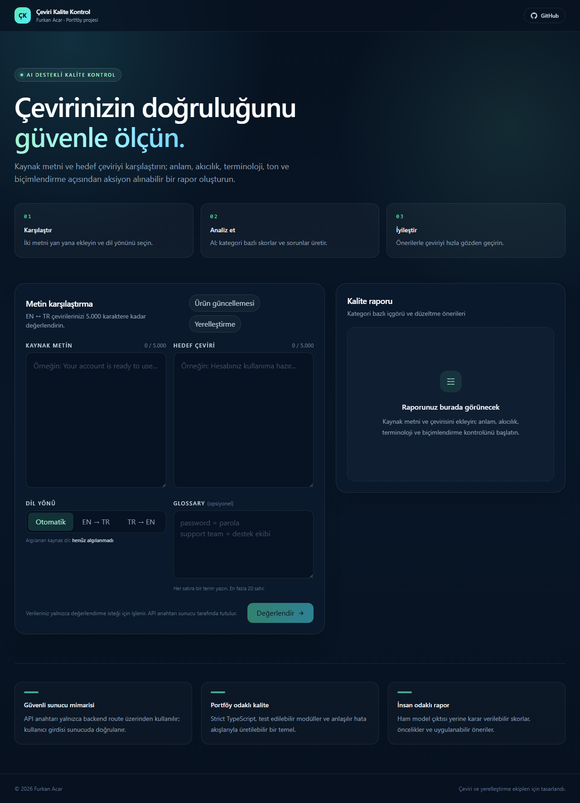

# Çeviri Kalite Kontrol

[GitHub deposu](https://github.com/acar32furkan-glitch/ceviri-kalite-kontrol) · [CI akışı](https://github.com/acar32furkan-glitch/ceviri-kalite-kontrol/actions) · AI destekli çeviri ve yerelleştirme kalite kontrol aracı. Kaynak metin ile hedef çeviriyi karşılaştırır; anlam doğruluğu, akıcılık, terminoloji, ton ve biçimlendirme korunumu için kategori bazlı skorlar ve uygulanabilir düzeltme önerileri üretir.



## Özellikler

- EN → TR ve TR → EN değerlendirme akışı
- Otomatik kaynak dil algılama fallback'u
- DeepSeek OpenAI uyumlu Chat Completions API ile sunucu taraflı kalite analizi
- Glossary/terim listesi desteği
- 0–100 genel puan ve beş kategori skoru
- Düşük, orta ve yüksek öncelikli sorun kartları
- Placeholder, sayı ve biçimlendirme korunumu kontrolü
- Boş/kısa metin, aynı metin, uzun metin ve hatalı glossary kontrolleri
- Sunucu tarafında doğrulama ve IP bazlı rate limiting
- API anahtarı yalnızca backend'de; client tarafına aktarılmaz
- Responsive, karanlık ve portföy odaklı arayüz

## Teknolojiler

- Next.js 16 App Router
- React 19
- TypeScript strict mode
- Tailwind CSS 4
- DeepSeek Chat Completions API
- Vitest
- ESLint 9

## Yerel kurulum

Gereksinimler: Node.js 20+ ve npm.

```bash
npm install
cp .env.example .env.local
```

`.env.local` dosyasına şu değişkenleri ekleyin:

```bash
DEEPSEEK_API_KEY=your_api_key
DEEPSEEK_MODEL=deepseek-v4-flash
DEEPSEEK_BASE_URL=https://api.deepseek.com
```

Uygulamayı başlatın:

```bash
npm run dev
```

Ardından `http://localhost:3000` adresini açın.

## Kontroller

```bash
npm run typecheck
npm test
npm run lint
npm run build
```

## API

`POST /api/evaluate`

```json
{
  "sourceText": "Your password has been reset.",
  "targetText": "Parolanız sıfırlandı.",
  "direction": "en-tr",
  "glossary": [
    { "source": "password", "target": "parola" }
  ]
}
```

Başarılı yanıt:

```json
{
  "report": {
    "overallScore": 92,
    "categoryScores": {
      "accuracy": 94,
      "fluency": 91,
      "terminology": 93,
      "tone": 90,
      "formatting": 92
    },
    "issues": []
  }
}
```

Backend, gelen metinleri talimat olarak değil yalnızca değerlendirilecek veri olarak işler. Hatalı JSON, aşırı uzun metin ve yapılandırma sorunları kullanıcıya güvenli ve anlaşılır mesajlarla döner.

## Teknik kararlar

- **Next.js App Router:** sayfa ve API route'larını tek bir tutarlı full-stack repo'da toplar.
- **Sunucu taraflı AI çağrısı:** API anahtarını client bundle'a taşımaz ve model yanıtını merkezî doğrulamadan geçirir.
- **Strict TypeScript ve ayrıştırılmış modüller:** prompt üretimi, validasyon, rate limiting ve API akışı bağımsız test edilebilir.
- **Tailwind CSS:** responsive arayüzü hızlı ve tutarlı biçimde oluşturur; özel renk ve arka plan katmanları proje kimliğini korur.
- **MVP sınırı:** Metin başına 5.000 karakter sınırı, faz 3'teki segment tabanlı uzun doküman desteğine geçişi netleştirir.

## Faz planı

- **Faz 1:** UI, API route, DeepSeek entegrasyonu ve ham rapor akışı tamamlandı.
- **Faz 2:** kategori raporu, glossary, uç durumlar, rate limiting, güvenlik ve testler tamamlandı.
- **Faz 3:** Supabase Auth, geçmiş değerlendirmeler, uzun doküman segmentleme, side-by-side diff ve PDF/CSV dışa aktarma eklenebilir.

## Deploy

Projeyi Vercel'e bağlayın ve proje ortamına `DEEPSEEK_API_KEY` ile isteğe bağlı `DEEPSEEK_MODEL` ve `DEEPSEEK_BASE_URL` değişkenlerini ekleyin. Production'da rate limiting stratejisini paylaşmalı depolama veya platform düzeyinde bir çözümle güçlendirin.

## Lisans

MIT. Detaylar için [LICENSE](LICENSE) dosyasına bakın.
